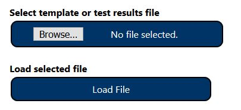

# ACRT
# Project Title
**Accessibility Conformance Reporting Tool (ACRT)** 

ACRT is a browser-based standalone application for recording accessibility test results from Trusted Testers. All input data will be stored as JSON &/or html files in the local machine which can be shared needed. Information in the JSON file can be further manipulated for analytics and reporting purposes as needed. 

## Getting Started
1) Download files to your local machine from the repository; default location is the Downloads folder. Select the Code button above and select "Download ZIP". Once downloaded, unzip/extract files. 
2) Refer to [ACRT Training Manual](https://github.com/Section508Coordinators/ACRT/blob/master/Resources/ACRTTrainingManual.pdf ) in the 'Resources' folder for detailed instructions. 

## Instructions
1) After ACRT is downloaded, unzip/extract files and open index.html  (preferred browsers are Firefox, Microsoft Edge, or Google Chrome).  
2) Select [Instruction](https://github.com/Section508Coordinators/ACRT/blob/master/Resources/ACRTTrainingManual.pdf ) to view detailed instruction manual in accessible PDF format.  
3) Select **'Create Report'** to create or edit test results. 
4) Select and load either standard template JSON file (TT4 or TT5 JSON file from 'Resources' folder for the first time) or valid custom JSON file (one you created or pre-filled for editing).  

5) Once you have filled/edited all required fields, you will see the option to save test results.
6) To save file changes, select the keyboard shortcut (Alt+z) or Save button located at the bottom of the page. 
7) File will be saved to your local machine (Downloads folder by default) as a JSON file; use this for editing or reporting purposes.  
8) Select **'Accessibility Conformance Report'** to view test results you have saved (with at least one valid test result). This is a read-only page, no edits allowed. To save as a printer-friendly HTML file, select the keyboard shortcut (Alt+s) or Save button located at the bottom of the page. 
9) You should save test results in both JSON (for editing) and HTML format (user-friendly) for future reference.  

## Versioning
For all users we are using [ACRTGitHubRepository](https://github.com/Section508Coordinators/ACRT). Department Of Homeland Security employees who don't have access to GitHub can use [ACRTBitbucketRepository](https://maestro.dhs.gov/stash/projects/APPDEV/repos/acrt/browse/acrt). Bitbucket requires DHS Network and user authentication.  Let's work together to make this tool great for all! Feel free to contribute. 

## Authors

* **Department Of Homeland Security ** - *Initial work* - 

* Contact
**[DHS Accessibility Help Desk](mailto:accessibility@hq.dhs.gov?subject=ACRT%20feedback)**

## License

This project is licensed under the MIT License - see the (LICENSE.md) file for details

